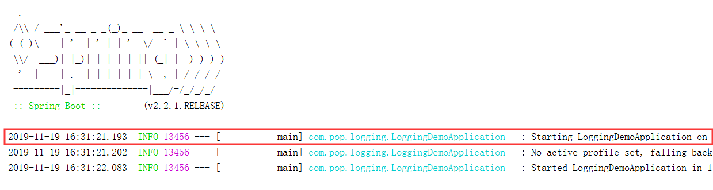

# Logging-demo

总结一下关于spring-boot中集成日志的具体细节。

关于日志工具的选择其实有很多种。

常见的日志框架: `JUL`、`JCL`、`Log4j`、`Log4j2`，`Logback`、`SLF4j`、`Jboss-logging`

| 抽象规范                                                     | 具体实现                                                   |
| ------------------------------------------------------------ | ---------------------------------------------------------- |
| JCL( Jakarta Commons Logging)<br />SLF4j(Simple Logging Facade for java)<br />jboss-logging | Log4j<br />JUL(java.util.logging)<br />Log4j2<br />Logback |

我们平时使用比较多的其实是 `Log4j`、`Logback`这些具体实现的jar包。

他们都实现了`SLF4j`的规范，`Log4j2`，但是设计比较复杂并且没有日志门面与之相匹配，作为企业级日志存在不稳定的问题。

日志的调用逻辑通常是：日志门面+日志实现，运行日志时调用日志门面的借口，但是配置采用日志实现的配置。

在`springboot`中，由于传统的`spring`采用到底是`JCL`的日志门面，所以`springboot`底层默认排除了`spring`框架处采用的`JCL`。

当然，这里统一用`logback`，原因是和`log4j`一样都实现了`SLF4J`门面，同时功能更加强大和期权。

> 日志相关组合包

| 组合名             | 依赖包                                                  |
| ------------------ | ------------------------------------------------------- |
| SLF4j              | 只导入SLF4j的jar包，没有实现日志，日志功能单一          |
| SLF4j+Logback      | 导入slf4j-api.jar和Logback相关jar包                     |
| SLF4j+Log4j        | 导入slf4j-api.jar、slf4j-log412.jar、log4j.jar三个jar包 |
| SLF4j+JUL          | 导入slf4j-api.jar、slf4j-jdk14.jar、JUL相关jar包        |
| SLF4j+slf4j-simple | 导入slf4j-api.jar、slf4j-simple.jar                     |

- 我们可以发现，SLF4j+Log4j相对于SLF4j+Logback多了一个jar包，多的这个slf4j-log412.jar是用来适配SLF4j和Log4j并整合它们；
- 每一个日志实现框架都有自己的配置文件，当你选择了日志门面和相关日志实现的依赖包组合后，日志最终会以日志实现框架的配置来实现日志的相应功能。

> 统一日志

有的时候当你将springboot导入到其他框架的时候，需要将工程里所有的框架的日志进行统一的框里，一致使用springboot默认的日志框架。

例如：spring(Commons-logging)、Hibernate(jboss-logging)

[具体可参考这里](<http://www.pianshen.com/article/9857273987/>)

根据不同的[日志系统](https://www.baidu.com/s?wd=%E6%97%A5%E5%BF%97%E7%B3%BB%E7%BB%9F&tn=24004469_oem_dg&rsv_dl=gh_pl_sl_csd)，springboot中你可以按如下规则组织配置文件名，就能被正确加载：

​         Logback：`logback-spring.xml`, `logback-spring.groovy`, `logback.xml`, `logback.groovy`

​         Log4j：`log4j-spring.properties`, `log4j-spring.xml`, `log4j.properties`, `log4j.xml`

​         Log4j2：`log4j2-spring.xml`, `log4j2.xml`

​         JDK (Java Util Logging)：`logging.properties`


#### 具体操作

首先`springboot`中默认引入了`Logback`来记录日志。

```xml
<dependencies>
        <dependency>
            <groupId>org.springframework.boot</groupId>
            <artifactId>spring-boot-starter</artifactId>
        </dependency>

<!-- 默认spring-boot-starter包中有一个logging包-->
 <dependency>
      <groupId>org.springframework.boot</groupId>
      <artifactId>spring-boot-starter-logging</artifactId>
      <version>2.2.1.RELEASE</version>
      <scope>compile</scope>
    </dependency>
<!-- 再点进去-->
<dependencies>
    <dependency>
        <!--logback的门面实现包-->
      <groupId>ch.qos.logback</groupId>
      <artifactId>logback-classic</artifactId>
      <version>1.2.3</version>
      <scope>compile</scope>
    </dependency>
    <dependency>
        <!--log4j为了适配slf4j而存在的适配包，如果想要使用log4j，需要先排除
			logback的实现，额外加入log4j的依赖-->
      <groupId>org.apache.logging.log4j</groupId>
      <artifactId>log4j-to-slf4j</artifactId>
      <version>2.12.1</version>
      <scope>compile</scope>
    </dependency>
    <dependency>
        <!--jul的适配包，原理和log4j一样-->
      <groupId>org.slf4j</groupId>
      <artifactId>jul-to-slf4j</artifactId>
      <version>1.7.29</version>
      <scope>compile</scope>
    </dependency>
  </dependencies>
</project>
```

我们一个新创建的项目，由于默认使用了slf4j+logback方式，且默认是`DEBUG`，那么DEBUG以下的所有等级的日志都知道。所以我们可以看到下面这样的显示



从左到右，内容是这样的

* 时间日期：精确到毫秒
* 日志级别：ERROR, WARN, INFO, DEBUG or TRACE
* 进程ID
* 分隔符： `---` 标识实际日志的开始
* 线程名：方括号里面的内容，也许会截断控制台输出
* Logger名：通常使用源代码的类名
* 日志内容


> 控制台输出

日志级别从低到高：

`TRACE` < `DEBUG` < `INFO` < `WARN` < `ERROR` < `FATAL`。

如果设置为 `WARN` ，则低于 `WARN` 的信息都不会输出。
 `Spring Boot`中默认配置`ERROR`、`WARN`和`INFO`级别的日志输出到控制台。还可以通过启动应用程序 `--debug` 标志来启用“调试”模式（开发的时候推荐开启）,以下两种方式皆可：

* 运行命令后加入 `--debug`，如：`$ java -jar xxxx.jar --debug`
* 在 `application.properties`中配置 `debug=true`，如果该属性为`true`，核心`logger`（包括嵌入式容器，hibernate，spring）会输出更多内容，但是**你自己应用日志，并不会输出为`debug`级别。**
* 

