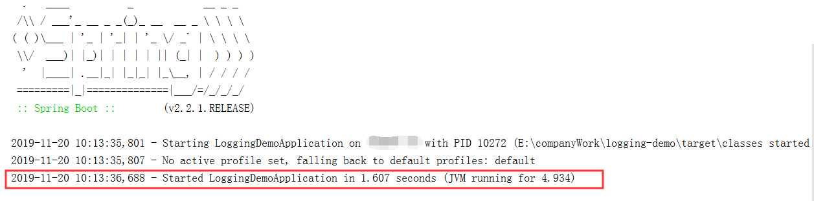
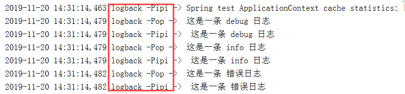
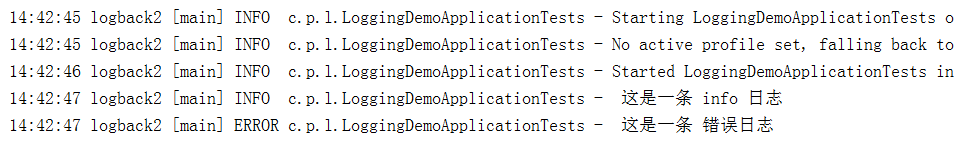
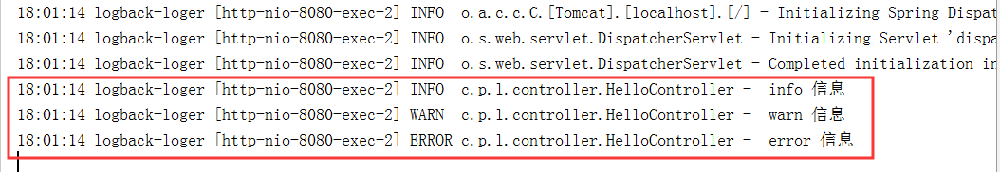
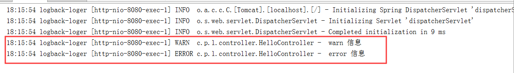
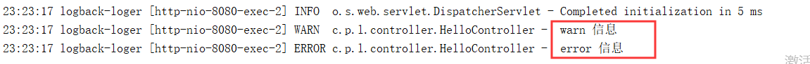
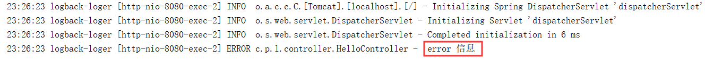

# Logging-demo

本节大部分内容来自 https://www.jianshu.com/p/f67c721eea1b。

总结一下关于spring-boot中集成日志的具体细节。

关于日志工具的选择其实有很多种。

常见的日志框架: `JUL`、`JCL`、`Log4j`、`Log4j2`，`Logback`、`SLF4j`、`Jboss-logging`

| 抽象规范                                                     | 具体实现                                                   |
| ------------------------------------------------------------ | ---------------------------------------------------------- |
| JCL( Jakarta Commons Logging)<br />SLF4j(Simple Logging Facade for java)<br />jboss-logging | Log4j<br />JUL(java.util.logging)<br />Log4j2<br />Logback |

我们平时使用比较多的其实是 `Log4j`、`Logback`这些具体实现的jar包。

他们都实现了`SLF4j`的规范，`Log4j2`，但是设计比较复杂并且没有日志门面与之相匹配，作为企业级日志存在不稳定的问题。

日志的调用逻辑通常是：日志门面+日志实现，运行日志时调用日志门面的借口，但是配置采用日志实现的配置。

在`springboot`中，由于传统的`spring`采用到底是`JCL`的日志门面，所以`springboot`底层默认排除了`spring`框架处采用的`JCL`。

当然，这里统一用`logback`，原因是和`log4j`一样都实现了`SLF4J`门面，同时功能更加强大和期权。

> 日志相关组合包

| 组合名             | 依赖包                                                  |
| ------------------ | ------------------------------------------------------- |
| SLF4j              | 只导入SLF4j的jar包，没有实现日志，日志功能单一          |
| SLF4j+Logback      | 导入slf4j-api.jar和Logback相关jar包                     |
| SLF4j+Log4j        | 导入slf4j-api.jar、slf4j-log412.jar、log4j.jar三个jar包 |
| SLF4j+JUL          | 导入slf4j-api.jar、slf4j-jdk14.jar、JUL相关jar包        |
| SLF4j+slf4j-simple | 导入slf4j-api.jar、slf4j-simple.jar                     |

- 我们可以发现，SLF4j+Log4j相对于SLF4j+Logback多了一个jar包，多的这个slf4j-log412.jar是用来适配SLF4j和Log4j并整合它们；
- 每一个日志实现框架都有自己的配置文件，当你选择了日志门面和相关日志实现的依赖包组合后，日志最终会以日志实现框架的配置来实现日志的相应功能。

> 统一日志

有的时候当你将springboot导入到其他框架的时候，需要将工程里所有的框架的日志进行统一的框里，一致使用springboot默认的日志框架。

例如：spring(Commons-logging)、Hibernate(jboss-logging)

[具体可参考这里](<http://www.pianshen.com/article/9857273987/>)

根据不同的[日志系统](https://www.baidu.com/s?wd=%E6%97%A5%E5%BF%97%E7%B3%BB%E7%BB%9F&tn=24004469_oem_dg&rsv_dl=gh_pl_sl_csd)，springboot中你可以按如下规则组织配置文件名，就能被正确加载：

​         Logback：`logback-spring.xml`, `logback-spring.groovy`, `logback.xml`, `logback.groovy`

​         Log4j：`log4j-spring.properties`, `log4j-spring.xml`, `log4j.properties`, `log4j.xml`

​         Log4j2：`log4j2-spring.xml`, `log4j2.xml`

​         JDK (Java Util Logging)：`logging.properties`


#### 具体操作

首先`springboot`中默认引入了`Logback`来记录日志。

```xml
<dependencies>
        <dependency>
            <groupId>org.springframework.boot</groupId>
            <artifactId>spring-boot-starter</artifactId>
        </dependency>

<!-- 默认spring-boot-starter包中有一个logging包-->
 <dependency>
      <groupId>org.springframework.boot</groupId>
      <artifactId>spring-boot-starter-logging</artifactId>
      <version>2.2.1.RELEASE</version>
      <scope>compile</scope>
    </dependency>
<!-- 再点进去-->
<dependencies>
    <dependency>
        <!--logback的门面实现包-->
      <groupId>ch.qos.logback</groupId>
      <artifactId>logback-classic</artifactId>
      <version>1.2.3</version>
      <scope>compile</scope>
    </dependency>
    <dependency>
        <!--log4j为了适配slf4j而存在的适配包，如果想要使用log4j，需要先排除
			logback的实现，额外加入log4j的依赖-->
      <groupId>org.apache.logging.log4j</groupId>
      <artifactId>log4j-to-slf4j</artifactId>
      <version>2.12.1</version>
      <scope>compile</scope>
    </dependency>
    <dependency>
        <!--jul的适配包，原理和log4j一样-->
      <groupId>org.slf4j</groupId>
      <artifactId>jul-to-slf4j</artifactId>
      <version>1.7.29</version>
      <scope>compile</scope>
    </dependency>
  </dependencies>
</project>
```

我们一个新创建的项目，由于默认使用了slf4j+logback方式，且默认是`DEBUG`，那么DEBUG以下的所有等级的日志都知道。所以我们可以看到下面这样的显示


从左到右，内容是这样的

* 时间日期：精确到毫秒
* 日志级别：ERROR, WARN, INFO, DEBUG or TRACE
* 进程ID
* 分隔符： `---` 标识实际日志的开始
* 线程名：方括号里面的内容，也许会截断控制台输出
* Logger名：通常使用源代码的类名
* 日志内容


> 控制台输出

日志级别从低到高：

`TRACE` < `DEBUG` < `INFO` < `WARN` < `ERROR` < `FATAL`。

如果设置为 `WARN` ，则低于 `WARN` 的信息都不会输出。
 `Spring Boot`中默认配置`ERROR`、`WARN`和`INFO`级别的日志输出到控制台。还可以通过启动应用程序 `--debug` 标志来启用“调试”模式（开发的时候推荐开启）,以下两种方式皆可：

* 运行命令后加入 `--debug`，如：`$ java -jar xxxx.jar --debug`
* 在 `application.properties`中配置 `debug=true`，如果该属性为`true`，核心`logger`（包括嵌入式容器，hibernate，spring）会输出更多内容，但是**你自己应用日志，并不会输出为`debug`级别。**


> 不配置额外的文件，而是在application.properties或application.yml

使用`SpringBoot`喜欢在`application.properties`或`application.yml`配置，这样只能配置简单的场景，保存日志，日志格式。

复杂的场景（区别info和error的日志、每天产生一个日志文件等）类似这样的需求，无法满足，只能自定义配置，下面会演示。

```properties
# 控制台，只输出 日期和内容
logging:
    pattern:
        console: "%d - %msg%n"
    #pattern:     原来的版本
    #	console: '%d{yyyy-MMM-dd HH:mm:ss.SSS} %-5level [%thread] %logger{15} - %msg%n'
```



也可以控制文件的输出路径，包括文件的名字

```properties
logging:
    pattern:
        console: "%d - %msg%n"
    file:
        path: ./logs/  
        name: ./log/my-spring.log
```

需要说明的是

* `logging.file.path`与`logging.file.name`不能共存，如果你同时设置了，会优先选择`logging.file.name`属性下的值。
* `path`属性只能指定路径，而不能指定名字，在`path`下指定的内容将会生成`spring.log`,而你再name中指定的话，不光可以指定路径，还可自定义名字

#### 级别控制

也可以控制某些日志的记录级别。

```properties
logging:
    pattern:
        console: "%d - %msg%n"
    file:
        path: ./logs/
        name: ./log/my-spring.log
    level: com.pop.demo: debug
```

指定包名或者类名:日志级别。

所有支持的日志记录系统都可以在`Spring`环境中设置记录级别（例如在`application.properties`中）
格式为：`'logging.level.* = LEVEL'`

* `logging.level`：日志级别控制前缀，*为包名或Logger名
* `LEVEL`：选项`TRACE, DEBUG, INFO, WARN, ERROR, FATAL, OFF`

##### 自定义日志配置

如果我们希望配置更加丰富，更多的自定义需要创建响应的配置文件。

你可以按照下面的规则配置文件名，保证可以正确的加载

* Logback：`logback-spring.xml, logback-spring.groovy, logback.xml, logback.groovy` 

* Log4j：`log4j-spring.properties, log4j-spring.xml, log4j.properties, log4j.xml` 

* Log4j2：`log4j2-spring.xml, log4j2.xml` 

* JDK (Java Util Logging)：`logging.properties`

`Spring Boot`官方推荐优先使用带有`-spring`的文件名作为你的日志配置（如使用`logback-spring.xml`，而不是`logback.xml`），命名为`logback-spring.xml`的日志配置文件，`spring boot`可以为它添加一些`spring boot`特有的配置项（下面会提到）。
 默认的命名规则，并且放在 `src/main/resources` 下面即可。

如果你即想完全掌控日志配置，但又不想用`logback.xml`作为`Logback`配置的名字，`application.yml`可以通过`logging.config`属性指定自定义的名字：

```properties
logging:
    pattern:
        console: "%d - %msg%n"
    file:
        path: ./logs/
        name: ./log/my-spring.log
    level: com.pop.demo: debug
    config: classpath: logging-config.xml
```

虽然一般并不需要改变配置文件的名字，但是如果你想针对不同运行时`Profile`使用不同的日志配置，这个功能会很有用。
 一般不需要这个属性，而是直接在`logback-spring.xml`中使用`springProfile`配置，不需要`logging.config`指定不同环境使用不同配置文件。`springProfile`配置在下面介绍。

```xml
<?xml version="1.0" encoding="utf-8" ?>
<!--
    scan ：如果此属性设置为true，配置文件如果发生变化，将会被重新加载，默认是true
    scanPeriod:设置监测配置文件是否有修改的时间间隔，如果没有给出时间单位，默认单位是毫秒。
    当scan为true时，此属性生效。默认的时间间隔为1分钟。
    debug:当此属性设置为true时，将打印出logback内部日志信息，实时查看logback运行状态。默认值为false。
-->
<configuration scan="true" scanPeriod="60 seconds" debug="false">

    <!--设置上下文名称
        每个logger都关联到logger上下文，
        默认上下文名称为default。但可以使用设置成其它名字，用于
        区别不同应用程序的记录。一旦设置就不能修改，通过
        %contextName 来打印日志上下文名称，一般来说
        我们不用这个属性，可有可无
    -->
    <contextName>logback</contextName>

    <!--
        用来定义变量值的标签，有两个属性，name和value
        其中name的值是变量的名称，value的值是用变量定义的值。
        通过定义的值会被插入到logger上下文中。定义变量后，
        可以使 "${}"来使用变量
    -->
    <property name="logback.logdir" value="./logdir/" />
    <property name="logback.appname" value="logDemo" />

    <!--
        appender
        appender 用来格式化日志输出节点，有两个属性
        name和class，class用来指定那种输出策略，常用
        就是控制台输出策略和文件输出策略。
    -->
    <!--
        控制台输出 ConsoleAppender
    -->
    <appender name="consoleLog1" class="ch.qos.logback.core.ConsoleAppender">
        <!--展示格式 layout-->
        <layout class="ch.qos.logback.classic.PatternLayout">
            <pattern>%d %contextName -Pop -> %msg%n</pattern>
        </layout>
    </appender>
    <!-- 控制台输出 的第二种形式-->
    <appender name="consoleLog2" class="ch.qos.logback.core.ConsoleAppender">
        <!--展示格式 layout-->
        <encoder>
            <pattern>%d %contextName -Pipi -> %msg%n </pattern>
        </encoder>
    </appender>

    <!--
        root 节点是必选节点，用来指定最基础的日志输出级别，只有一个level属性
        level:用来设置打印级别，大小写无关：TRACE, DEBUG, INFO, WARN, ERROR, ALL 和 OFF，不能设置为INHERITED或者同义词NULL。
        默认是DEBUG。可以包含零个或多个元素，标识这个appender将会添加到这个loger
    -->
    <root level="debug">
        <appender-ref ref="consoleLog1" />
        <appender-ref ref="consoleLog2" />
    </root>
</configuration>
```



可以看到`layout`和`encoder`，都可以将事件转换为格式化后的日志记录，但是控制台输出使用`layout`，文件输出使用`encoder`

另一种输出

```xml
<?xml version="1.0" encoding="utf-8" ?>
<configuration scan="true" scanPeriod="60 seconds" debug="false">

    <contextName>logback2</contextName>

    <!--
        appender
        appender 用来格式化日志输出节点，有两个属性
        name和class，class用来指定那种输出策略，常用
        就是控制台输出策略和文件输出策略。
    -->
    <!--
        控制台输出 ConsoleAppender
    -->
    <appender name="consoleLog1" class="ch.qos.logback.core.ConsoleAppender">
        <!--展示格式 layout-->
        <layout class="ch.qos.logback.classic.PatternLayout">
            <pattern>
                <pattern>
                    %d{HH:mm:ss} %contextName [%thread] %-5level %logger{36} - %msg%n
                </pattern>
            </pattern>
        </layout>
        <!--
		ThresholdFilter为系统定义的拦截器，例如我们用ThresholdFilter来过滤掉ERROR级别以下的日志不输出到文件中。如果不用记得注释掉，不然你控制台会发现没日志~
       <filter class="ch.qos.logback.classic.filter.ThresholdFilter">
            <level>ERROR</level>
       </filter>
        -->
    </appender>

    <!--
        root 节点是必选节点，用来指定最基础的日志输出级别，只有一个level属性
        level:用来设置打印级别，大小写无关：TRACE, DEBUG, INFO, WARN, ERROR, ALL 和 OFF，不能设置为INHERITED或者同义词NULL。
        默认是DEBUG。可以包含零个或多个元素，标识这个appender将会添加到这个loger
    -->
    <root level="info">
        <appender-ref ref="consoleLog1" />
        <!--<appender-ref ref="consoleLog2" />-->
    </root>
</configuration>
```



当然第一种的实例会产生大量日志，因为所有的运行的日志都会打印出来，内容会比较多。

第二种只会允许匹配的我们定义的，包括我们自己的写的日志类型，所以总体会比较少。


##### 输出到文件 

* 另一种创建的日志输出到文件，随着应用的运行时间越长，日志也会增长的越来越多，将她们输出到同一个文件并非是一个好办法，`RollingFileAppender`用于切分文件日志。

* %d{HH: mm:ss.SSS}——日志输出时间

* %thread——输出日志的进程名字，这在Web应用以及异步任务处理中很有用

* %-5level——日志级别，并且使用5个字符靠左对齐

* %logger{36}——日志输出者的名字

* %msg——日志消息

* %n——平台的换行符


```xml
<?xml version="1.0" encoding="utf-8" ?>
<configuration scan="true" scanPeriod="60 seconds" debug="false">

    <contextName>logback-appendFile</contextName>
    <property name="logback.logdir" value="./logdir/" />
    <property name="logback.app" value="logAppendFile" />
    <appender name="fileInfoLog" class="ch.qos.logback.core.rolling.RollingFileAppender">
        <!--
        如果只是想要info级别的信息。只是过滤 info 还是会输出Error日志
        因为Error的级别高，
        所以我们使用下面策略，可以避免输出 Error日志
        -->
        <filter class="ch.qos.logback.classic.filter.LevelFilter">
            <!--过滤 Error-->
            <level>ERROR</level>
            <!--匹配到就禁止 DENY 拒绝-->
            <onMatch>DENY</onMatch>
            <!--没有匹配到就允许-->
            <onMismatch>ACCEPT</onMismatch>
        </filter>
        <!--
        日志名称，如果没有File属性，那么只会使用
        FileNamePattern的文件路径规则。
        如果同时有<File> 和 <FileNamePattern>,
        那么当天日志是<File>，明天会自动把今天的日志改成
        今天的日期。即File的日志都是当天的
        -->
        <File>${logback.logdir}/info.${logback.app}.log</File>

        <!-- 滚动策略，按照时间滚动 TimeBasedRollingPolicy-->
        <rollingPolicy class="ch.qos.logback.core.rolling.TimeBasedRollingPolicy">
            <!--文件路径,定义了日志的切分方式——把每一天的日志归档到一个文件中,以防止日志填满整个磁盘空间-->
            <FileNamePattern>
                ${logback.logdir}/info.${logback.app}.%d{yyyy-MM-dd}.log
            </FileNamePattern>
            <!--只保留最近30天的日志-->
            <maxHistory>30</maxHistory>
            <!--用来指定日志文件的上限大小，如果到达这个值，会删除最老的日志-->
            <!--<totalSizeCap>1GB</totalSizeCap>-->
        </rollingPolicy>
        <!-- 之前我们说过当控制台输出的时候，使用layout，文件
            输出的时候，用encoder-->
        <encoder>
            <charset>UTF-8</charset>
            <pattern>%d [%thread] %-5level %logger{36} %line - %msg%n</pattern>
        </encoder>
    </appender>

    <!--只想要Error，除此之外不想要其它的-->
    <appender name="fileErrorLog" class="ch.qos.logback.core.rolling.RollingFileAppender">
        <!--
        如果只是想要 Error 级别的日志，那么需要过滤一下，默认是 info 级别的，ThresholdFilter
        -->
        <filter class="ch.qos.logback.classic.filter.ThresholdFilter">
            <!--设置只要Error-->
            <level>ERROR</level>
        </filter>
        <!--
        日志名称，如果没有File属性，那么只会使用
        FileNamePattern的文件路径规则。
        如果同时有<File> 和 <FileNamePattern>,
        那么当天日志是<File>，明天会自动把今天的日志改成
        今天的日期。即File的日志都是当天的
        -->
        <File>${logback.logdir}/error.${logback.app}.log</File>

        <!-- 滚动策略，按照时间滚动 TimeBasedRollingPolicy-->
        <rollingPolicy class="ch.qos.logback.core.rolling.TimeBasedRollingPolicy">
            <!--文件路径,定义了日志的切分方式——把每一天的日志归档到一个文件中,以防止日志填满整个磁盘空间-->
            <FileNamePattern>
                ${logback.logdir}/error.${logback.app}.%d{yyyy-MM-dd}.log
            </FileNamePattern>
            <!--只保留最近30天的日志-->
            <maxHistory>30</maxHistory>
            <!--用来指定日志文件的上限大小，如果到达这个值，会删除最老的日志-->
            <!--<totalSizeCap>1GB</totalSizeCap>-->
        </rollingPolicy>
        <!-- 之前我们说过当控制台输出的时候，使用layout，文件
            输出的时候，用encoder-->
        <encoder>
            <charset>UTF-8</charset>
            <pattern>%d [%thread] %-5level %logger{36} %line - %msg%n</pattern>
        </encoder>
    </appender>
    <!--
        root 节点是必选节点，用来指定最基础的日志输出级别，只有一个level属性
        level:用来设置打印级别，大小写无关：TRACE, DEBUG, INFO, WARN, ERROR, ALL 和 OFF，不能设置为INHERITED或者同义词NULL。
        默认是DEBUG。可以包含零个或多个元素，标识这个appender将会添加到这个loger
    -->
    <root level="info">
        <appender-ref ref="fileInfoLog" />
        <appender-ref ref="fileErrorLog" />
    </root>
</configuration>
```

#### 子节点 loger

* `<loger>`用来设置某一个包或者具体的某一个类的日志打印级别、以及指定`<appender>`。`<loger>`仅有一个`name`属性，一个可选的`level`和一个可选的`addtivity`属性。

`name`:用来指定受此loger约束的某一个包或者具体的某一个类。

*  `level`:用来设置打印级别，大小写无关：TRACE, DEBUG, INFO, WARN, ERROR, ALL 和 OFF，还有一个特俗值INHERITED或者同义词NULL，代表强制执行上级的级别。如果未设置此属性，那么当前loger将会继承上级的级别。

* `addtivity`:是否向上级loger传递打印信息。默认是true。

```java
@RestController
@Slf4j
public class HelloController {

    @GetMapping("/")
    public String hello(){
////日志级别从低到高分为
// TRACE < DEBUG < INFO < WARN < ERROR < FATAL，
// 如果设置为WARN，则低于WARN的信息都不会输出。
        log.trace(" trace 信息");
        log.debug(" debug 信息");
        log.info(" info 信息");
        log.warn(" warn 信息");
        log.error(" error 信息");

        return "hello , world";
    }

}
```

我们定义了几种级别的日志，然后在`logback-spring.xml`中的配置来打印不同级别的日志。

##### 第一种：带有 loger 的配置，不指定级别，不指定 appender

`logback-spring.xml`增加 `loger` 配置如下：

```xml
<?xml version="1.0" encoding="utf-8" ?>

<configuration scan="true" scanPeriod="60 seconds" debug="false">


    <contextName>logback-loger</contextName>
    <!--
    将控制controller包下的所有类的日志的打印，但是并没用设置打印级别，所以继承他的上级的日志级别“info”；
没有设置addtivity，默认为true，将此loger的打印信息向上级传递；
没有设置appender，此loger本身不打印任何信息。
<root level="info">将root的打印级别设置为“info”，指定了名字为“console”的appender。
    -->
    <logger name="com.pop.logging.controller"/>

    <appender name="console" class="ch.qos.logback.core.ConsoleAppender">
        <!--展示格式 layout-->
        <layout class="ch.qos.logback.classic.PatternLayout">
            <pattern>
                <pattern>
                    %d{HH:mm:ss} %contextName [%thread] %-5level %logger{36} - %msg%n
                </pattern>
            </pattern>
        </layout>
    </appender>
    
    <root level="info">
        <!--- 指定输出到控制台-->
        <appender-ref ref="console" />
    </root>
</configuration>
```




由于 root 指定了 info，所以 info以下的都会被打印。

当执行`com.pop.logging.controller.HelloController`类的`hello`方法时，`HelloController` 在包`com.pop.logging.controller`中，所以首先执行`<logger name="com.pop.logging.controller"/>`，将级别为`“info”`及大于`“info”`的日志信息传递给`root`，本身并不打印；
 `root`接到下级传递的信息，交给已经配置好的名为“console”的`appender`处理，`“console”` `appender` 将信息打印到控制台；

##### 第二种：带有多个logger 的配置，指定级别，指定appender

`logback-spring.xml` 增加 `loger` 配置如下:

```xml
<logger name="com.pop.logging.controller.HelloController" level="WARN" additivity="false">
        <appender-ref ref="console"/>
    </logger>
```

控制`com.pop.logging.controller.HelloController`类的日志打印，打印级别为“`WARN`”;
 `additivity`属性为`false`，表示此`loger`的打印信息不再向上级传递;
 指定了名字为“`console`”的`appender`;

这时候执行`com.pop.logging.controller.HelloController`类的hello方法时，先执行`<logger name="com.pop.logging.controller.HelloController" level="WARN" additivity="false">`,将级别为“`WARN`”及大于“WARN”的日志信息交给此`loger`指定的名为“`console`”的`appender`处理，在控制台中打出日志，不再向上级`root`传递打印信息

当然如果你把`additivity="false"`改成`additivity="true"`的话，就会打印两次，因为打印信息向上级传递，logger本身打印一次，root接到后又打印一次。



相同范围进行叠加，范围小的有效。


#### 指定 profile 进行日志打印

```xml
<springProfile name="dev">
        <logger name="com.pop.logging.controller.HelloController" level="WARN" additivity="false" >
            <appender-ref ref="consoleLog" />
        </logger>
    </springProfile>

    <springProfile name="prod">
        <logger name="com.pop.logging.controller.HelloController" level="ERROR" additivity="false" >
            <appender-ref ref="consoleLog" />
        </logger>
    </springProfile>
```

当你配置成这样的时候

```properties
spring:
    profiles:
        active: dev
```



```properties
spring:
    profiles:
        active: prod
```



可以根据配置文件的profile，也可以控制日志级别